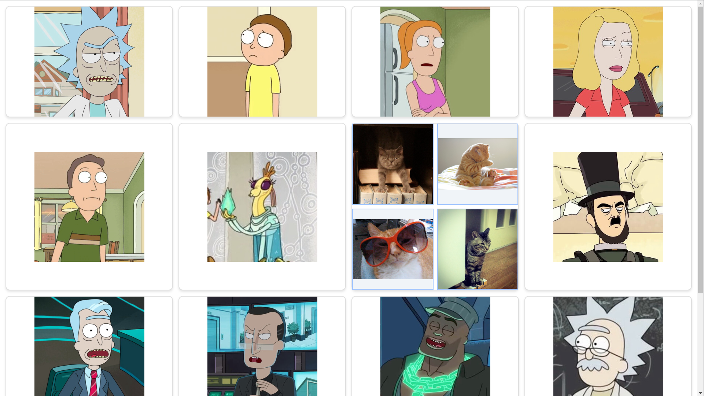

# Grid y Flexbox Layout con CSS Nativo

> [!NOTE]
> [Ver Demo](https://dor-ae2-grid-layout-flexbox.netlify.app/)

## Autor

- [Adán Pérez](https://github.com/Adan-Perez)

## Repositorio

- [Repositorio en GitHub](https://github.com/Adan-Perez/ae2-grid-layout-flexbox)

## Descripción

Este proyecto es una cuadrícula diseñada con CSS Grid y Flexbox que incluye imágenes adaptables, un subgrid con características diferenciadoras y es completamente responsivo.

## Características

1. **Cuadrícula Principal (4x4)**:

   - Diseñada con CSS Grid.
   - Contiene 16 elementos (4 filas x 4 columnas).
   - Cada celda incluye una imagen centrada horizontal y verticalmente utilizando Flexbox.

2. **Subgrid**:

   - Una de las celdas contiene un subgrid que hereda la estructura de la cuadrícula principal (2x2).
   - Las celdas del subgrid tienen un diseño diferenciado con:
     - Fondo especial.
     - Bordes destacados.
     - Efectos `hover`.

3. **Responsividad**:

   - La cuadrícula se adapta automáticamente a diferentes tamaños de pantalla:
     - **Tablets (≤ 1024px):** 2 columnas.
     - **Móviles grandes (≤ 768px):** 1 columna.
     - **Pantallas pequeñas (≤ 480px):** Las imágenes se ajustan completamente dentro de las celdas sin recortarse.

4. **Diseño moderno**:

   - Uso de sombras, transiciones y bordes redondeados para un diseño atractivo.

5. **Metodología BEM**:
   - Se utiliza la metodología BEM para una estructura clara y fácil de mantener.

## Tecnologías Utilizadas

- **HTML5**: Para la estructura del proyecto.
- **CSS3**: Para el diseño de la cuadrícula y el subgrid con CSS Grid y Flexbox.
- **Responsive Design**: Uso de `@media` queries para la adaptabilidad del diseño.

## Estructura del Proyecto

```plaintext
project/
├── index.html  # Archivo principal HTML
├── styles.css  # Archivo de estilos CSS
├── images      # Carpeta de imágenes
├── todo.md     # Archivo de tarea a realizar
└── README.md   # Archivo de documentación
```

## Vista Previa


